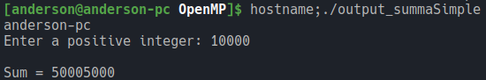
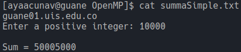

# Procesamiento de Memoria Compartida

## Descripción
El propósito del algoritmo es calcular la suma de los primeros *n* números naturales. Esta sería su 
interpretación matemática:

```math
sum=\sum_{k=1}^n k
```

Se parte de una implementación que se ejecuta en un solo hilo, para transformarla en una que se ejecute en 
paralelo. Se utilizó la librería OpenMP para este propósito, específicamente así:

```c
#pragma omp parallel
{
    #pragma omp for reduction(+:sum)
    for(count = 1; count <= num; ++count)
    {
        sum += count;
    }
}
```

Con `#pragma omp parallel` anunciamos que vamos a abrir una región paralela y todo lo que esté dentro de 
las llaves se ejecutará usando todos los hilos, por defecto. Con la directiva `for` que está en el pragma le 
decimos que el ciclo que está abajo divida la ejecución de sus repeticiones en partes iguales para cada hilo. 
Finalmente, con la clausula `reduction(+:sum)` le decimos que cada hilo guarde una copia local de la variable 
*sum*, y con el *+* le indicamos que al finalizar la tarea sume los resultados de todos los hilos para esa 
variable.

## Opciones de compilación
Para compilar se utilizó el compilador *gcc 9.2.0*, de la siguiente manera:
1. `gcc -fopenmp omp_summaSimple.c -o output_summaSimple`: Para compilar el código fuente de nuestra 
solución en paralelo, indicando que utilice *OpenMP*.
2. `./output_summaSimple`: Para ejecutar el binario que creamos en el primer paso.

## Arquitecturas donde se ejecutó
### Máquina local
Se corrieron las instrucciones de compilación manualmente y la salida estándar quedó así:


### GUANE
Para correr el algoritmo en GUANE se utilizó el archivo `summaSimple.sbatch`, apoyado en el sistema *SLURM* 
que ya está instalado y nos permite usar su comando `sbatch`:


