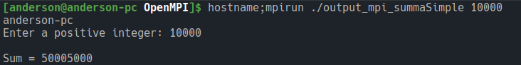
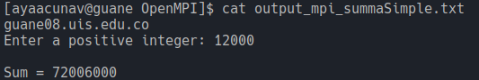

# Procesamiento de Memoria Distribuida

## Descripción
El propósito del algoritmo es calcular la suma de los primeros *n* números naturales. Esta sería su 
interpretación matemática:

```math
sum=\sum_{k=1}^n k
```

Se parte de una implementación que se ejecuta en forma serial, para transformarla en una que se ejecute en 
paralelo por mensajes. Se utilizó la librería OpenMPI para este propósito, específicamente así:

1. Empezamos a reconocer el soporte de tareas que se pueden ejecutar, junto con el identificador de 
cada mensaje.
```c
int tareas, rango;
MPI_Init(&argc, &argv);
MPI_Comm_size(MPI_COMM_WORLD, &tareas);
MPI_Comm_rank(MPI_COMM_WORLD, &rango);
```

2. Definimos intervalos suficientes para que cada nodo pueda operar una parte del problema.
```c
int tamanho_trozo = num / tareas;
int inicio_trozo = rango * tamanho_trozo + 1;
int fin_trozo = inicio_trozo + tamanho_trozo - 1;
```

3. Cada mensaje es la suma de todos los números comprendidos en esos subintervalos.
```c
int suma_parcial = 0;
for(count = inicio_trozo; count <= fin_trozo; count++) {
    suma_parcial += count;
}
```

4. Finalmente, se unen los valores individuales hechos en cada nodo para calcular la suma total.
```c
MPI_Reduce(&suma_parcial, &sum, 1, MPI_INT, MPI_SUM, 0, MPI_COMM_WORLD);
```

> Esta solución propuesta tiene la limitación de que el número *n* a calcular debe ser múltiplo 
de la cantidad de tareas posibles o propuestas a realizar, ya que cuando se hacen los subintervalos 
la variable tipo entero no puede contener valores decimales; por lo tanto, se empieza a percibir 
errores en los resultados.

## Opciones de compilación
Para compilar se utilizó el compilador *gcc 9.2.0(GUANE)* y *gcc 12.2.1(Local)*, de la siguiente 
manera:
1. `mpicc -Wall mpi_summaSimple.c -o output_mpi_summaSimple`: Para compilar el código fuente de nuestra 
solución en paralelo.
2. `mpirun ./output_mpi_summaSimple 10000`: Para ejecutar el binario que creamos en el primer paso.

## Arquitecturas donde se ejecutó
### Máquina local
Se corrieron las instrucciones de compilación manualmente y la salida estándar quedó así:



### GUANE
Para correr el algoritmo en GUANE se utilizó el archivo `summaSimple-mpi.sbatch`, apoyado en el 
sistema *SLURM* que ya está instalado y nos permite usar su comando `sbatch`:



